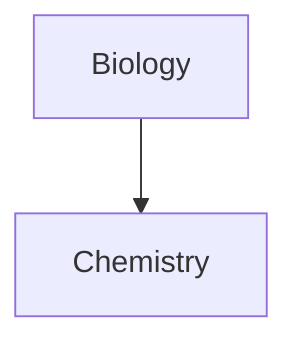

# Markdown Basics
Source:  
- [Basic Syntax - MarkdownGuide.org](https://www.markdownguide.org/basic-syntax/)  
- [Markdown Cheat-sheet](https://www.markdownguide.org/cheat-sheet/)
- [Official Obsidian Formatting Guide](https://help.obsidian.md/How+to/Format+your+notes)
- [MkDocs-Material Reference](https://squidfunk.github.io/mkdocs-material/reference/)
---
## Links
```
[Text](Link)
```
Example:
```
[This is a link](https://www.google.com)
[This is also a link](#Link to section)
```
[This is a link](https://www.google.com)
[This is also a link](#Links)

---

## Code Blocks

````
``` [language] [title="Title!"] [linenums="1" (for line numbers)]
Code here
```
````

Code Blocks can also have syntax highlighting:
```vhdl title="Title for code blocks!" linenums="1"
library IEEE;
use IEEE.std_logic_1164.all;
use IEEE.std_logic_unsigned.all;

entity Q1c2 is
    port (A, B : in std_logic_vector(3 downto 0);
              S : in std_logic_vector(1 downto 0); -- (1)
              Y : out std_logic_vector(3 downto 0));
end entity Q1c2;

architecture behaviour of Q1c2 is
begin
    Y <=  A when S = "00" else
     B when S = "11";
end architecture behaviour;
```
1.  I'm a code annotation! I can contain `code`, __formatted [](https://squidfunk.github.io/mkdocs-material/reference/code-blocks/#__codelineno-8-8)text__, images, ... basically anything that can be written in Markdown.

---
## Math Equations
Markdown with latex equation syntax is supported
Source: 
- [GitHub Docs - Markdown Mathematical Expressions](https://docs.github.com/en/get-started/writing-on-github/working-with-advanced-formatting/writing-mathematical-expressions)
- [Latex Mathematics](https://en.wikibooks.org/wiki/LaTeX/Mathematics)
- [Cheat-sheet](http://tug.ctan.org/info/undergradmath/undergradmath.pdf)  

$$ x = -b\pm\sqrt{b^2-4ac} \over 2a $$
```
$$ x = -b \pm \sqrt{b^2-4ac} \over 2a $$
```

## HTML Formatting
Markdown can also use HTML code for formatting

<p>A paragraph in <b>HTML</b> displayed as code</p>
___
## Mermaid Diagrams
````

````


